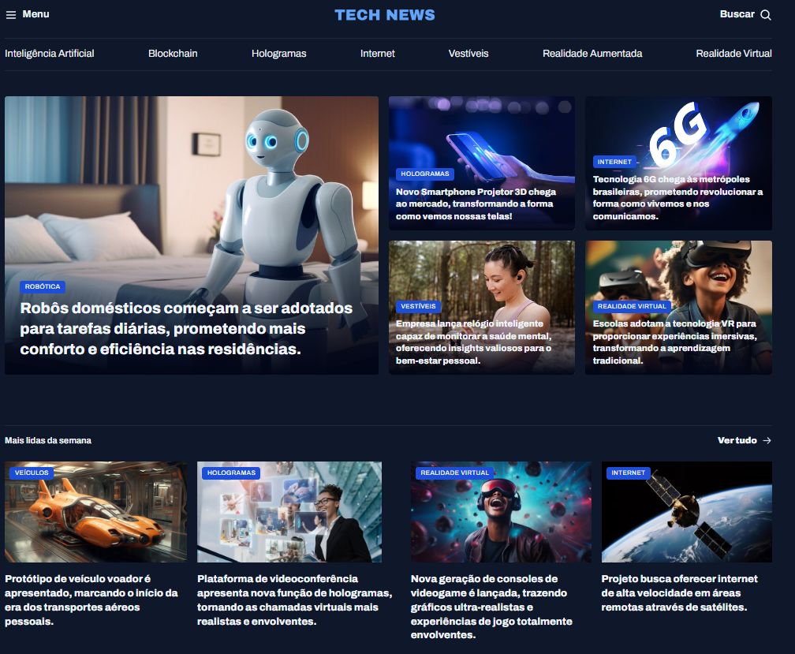

# 📰 Tech News - Portal de Notícias de Tecnologia

Este projeto é um **portal de notícias** focado em tecnologia, trazendo as últimas novidades sobre **Inteligência Artificial, Blockchain, Hologramas, Internet, Dispositivos Vestíveis, Realidade Aumentada e Realidade Virtual**.

## 📸 Preview

---

## 🚀 Funcionalidades

- **Menu de Categorias:**  
  Navegação rápida entre os principais tópicos de tecnologia.

- **Destaques em Tela Cheia:**  
  Seção principal com notícias de maior relevância, com imagens chamativas.

- **Sessão "Mais Lidas da Semana":**  
  Lista as notícias mais populares de acordo com engajamento dos usuários.

- **Destaques de Inteligência Artificial:**  
  Curadoria de notícias sobre IA e inovações no setor.

- **Design Responsivo:**  
  Interface adaptável para dispositivos móveis e desktop.
